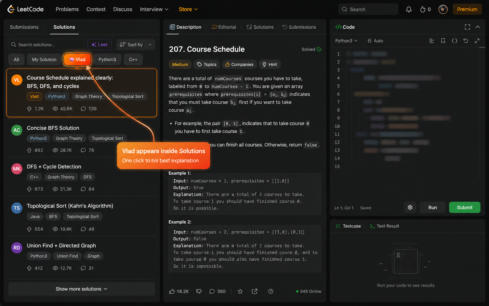

<div align="center">


# Vlad for LeetCode

**Instantly surface [votrubac's](https://leetcode.com/u/votrubac/) (Vlad Trubachov's) best-explained solutions on any LeetCode problem.**

[](https://chromewebstore.google.com)
[](https://microsoftedge.microsoft.com/addons)
[](LICENSE)
[](extension/solutions.json)

</div>

---

## What it does

Vlad Trubachov (`votrubac`) is one of LeetCode's most respected contributors — his solutions are famous for being genuinely easy to understand, not just correct. The problem? LeetCode's search doesn't let you filter by author.

This extension adds an **🧠 Vlad pill** directly into the Solutions tab filter bar on every problem page. One click takes you straight to his solution (if he's posted one). If he hasn't, the pill is greyed out so you know immediately.

**No sign-in. No account. No data collection. Works offline.**

---

## Screenshots

| Vlad's solution found | Extension in context |
|---|---|
|  |  |

---

## Install

### Option A — Chrome Web Store *(coming soon)*

### Option B — Microsoft Edge Add-ons *(coming soon)*

### Option C — Install manually (any Chromium browser)

> Works on Chrome, Brave, Edge, Arc, Opera — anything Chromium-based.

1. **Download** the latest release zip from the [Releases page](../../releases)
2. Unzip it anywhere on your computer
3. Open your browser's extensions page:
   - Chrome/Brave/Arc: `chrome://extensions`
   - Edge: `edge://extensions`
   - Opera: `opera://extensions`
4. Enable **Developer mode** (toggle, top-right corner)
5. Click **"Load unpacked"**
6. Select the unzipped `extension/` folder
7. Done — navigate to any LeetCode problem and open the Solutions tab

---

## Build from source

```bash
git clone https://github.com/parity-byte/vlad-trubachov-leetcode-extension.git
cd vlad-trubachov-leetcode-extension
# No build step needed — the extension folder is ready to load directly
```

Then follow the "Install manually" steps above, pointing to the `extension/` folder.

---

## Update the solution database

Vlad posts new solutions regularly. To rebuild `solutions.json` with the latest:

1. Go to [leetcode.com/u/votrubac/](https://leetcode.com/u/votrubac/) and click the **Solutions** tab
2. Open browser DevTools console (`Cmd+Option+J` / `F12`)
3. Paste and run the script from [`scraper/console-scrape.js`](scraper/console-scrape.js)
4. Wait ~2 minutes for it to click through all pages and auto-download `vlad-solutions.json`
5. Replace `extension/solutions.json` with the downloaded file
6. Reload the extension

---

## Project structure

```
extension/          ← The actual extension (load this folder)
  manifest.json
  content.js        ← Injects the Vlad pill into the Solutions tab
  content.css       ← Minimal CSS (hover glow + entry animation)
  solutions.json    ← Static lookup: problemSlug → solution URL
  icon48.png
  icon128.png

scraper/
  console-scrape.js ← Paste in browser console to rebuild solutions.json
```

---

## Privacy

This extension makes **zero network requests** and collects **no data**. Everything is bundled statically. [Full privacy policy →](PRIVACY_POLICY.md)

---

## Contributing

PRs welcome! The most useful contribution is keeping `solutions.json` up to date — just run the scraper and open a PR with the updated file.

---

## License

MIT — do whatever you want with it.

---

<div align="center">
Made for anyone who's spent too long searching for the clearest explanation.
</div>
